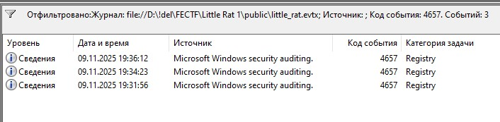
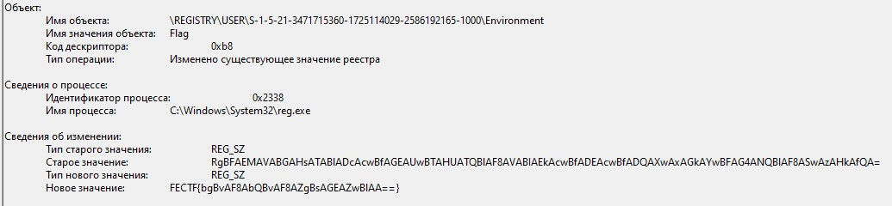

# forensics | Little Rat 1

## Описание

Паркер! У нас кризис! Это приложение "blogspot" используют все мои журналисты. Внезапно у половины отдела перестали работать лицензии, а вместо нормальных ключей отображается невесть что! Я не верю в совпадения. Бери эти логи и ищи способ вернуть ключи лицензий на место. И чтобы успешный отчет был у меня на столе еще вчера!

## Флаг

`FECTF{Le7s_aSSuMe_THIs_1s_4_1icEn5e_K3y}`

## Решение

Участникам дан журнал security событий Windows - `little_rat.evtx`.

В ходе атаки использованно вполне легитимное приложение (из за уязвимости в модуле работает как реверс шелл, а сервер аутентификации подменен на C2), которое периодически запрашивает с сервера C2 пейлод.

В текущем таске пейлод для кражи и подмены значения в реестре.

Описание прямо говорит про **ключи лицензий**.

Если вы полезете искать где обычно хранятся ключи лицензий, то найдете два наиболее вероятных места, учитывая предоставленный лог, это файловая система и реестр.

Само событие доступа к ключам реестра не дает информации об их значении, а вот изменение да.

Описание так же намекает, что **ключи лицензий** были заменены. Остается только найти какой ID присваивается такому событию и отфильтровать лог. `ID 4657`

Таких событий всего 3 в логе.

Ключ реестра `Flag` в разделе `Environment` содержал флаг в `Base64`. Пейлод заменил его на фальшивый.

Кодировка UTF-16LE

Фальшивый флаг: FECTF{bgBvAF8AbQBvAF8AZgBsAGEAZwBlAA==} -> FECTF{no_mo_flage}

Настоящий флаг: RgBFAEMAVABGAHsATABlADcAcwBfAGEAUwBTAHUATQBlAF8AVABIAEkAcwBfADEAcwBfADQAXwAxAGkAYwBFAG4ANQBlAF8ASwAzAHkAfQA= -> FECTF{Le7s_aSSuMe_THIs_1s_4_1icEn5e_K3y}