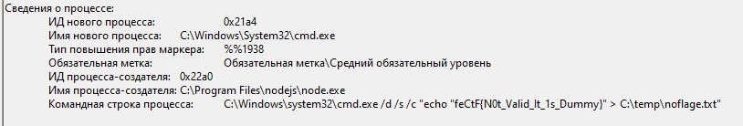
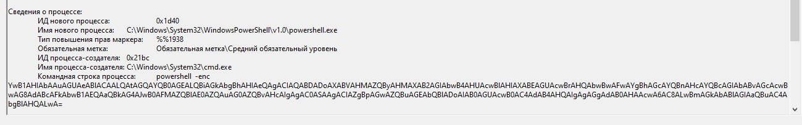
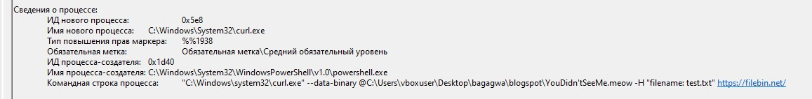

# forensics | Little Rat 2

## Описание

Паркер! Как успехи с прошлой задачей? А не важно, видимо эти жулики не остановились! Пока ты копался с лицензиями, у части отдела начали тормозить компьютеры! Я хочу, чтобы ты перерыл эти логи еще раз и нашёл, ради чего они это делают! И не вздумай говорить, что это невозможно! Я плачу тебе за невозможное!

Формат флага: FECTF{filename.ext}

## Флаг

`FECTF{YouDidn'tSeeMe.meow}`

## Решение

Участникам дан журнал security событий Windows - `little_rat.evtx`.

Весь лог собирался с перезапуска и почти чистой установки приложения. Так как привилегии админа были только на момент установки, сам дамп собран давно в логе.

В ходе атаки использованно вполне легитимное приложение (из за уязвимости в модуле работает как реверс шелл, а сервер аутентификации подменен на C2), которое периодически запрашивает с сервера C2 пейлод.

В текущем таске пейлод для кражи уже подготовленного дампа lsass.exe.

Описание прямо говорит про **начали тормозить компьютеры**.

Если смотреть лог, недалеко от начала можно увидеть достаточно плотный стек событий `4688` и `4689`.

Технически **тормозят компьютеры** здесь из за нескольких синхронных вызовов, пока вся остальная куча вызывается асинхронно.

Могу лишь предложить исключить события WFP, чтобы не мешались:
* `5158`
* `5156`
* `5154`

Начало выполнения пейлода можно найти по этому событию, сделано для привлечения внимания.

В пейлоде много команд для cmd и powershell (закодированные в base64).

**Я хочу, чтобы ты перерыл эти логи еще раз и нашёл, ради чего они это делают!**

Вам придется перебирать события чтобы найти среди мусорных вызовов подозрительные.

Сам вызов был в 19:36:44.

Но чуть дальше его вызвало в открытую.

Собственно `YouDidn'tSeeMe.meow` это как раз то **ради чего они это делают**.

В формате флага явно сказано дать имя файла с расширением.