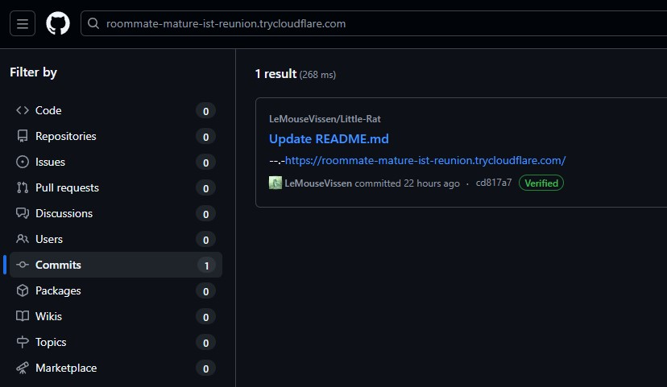
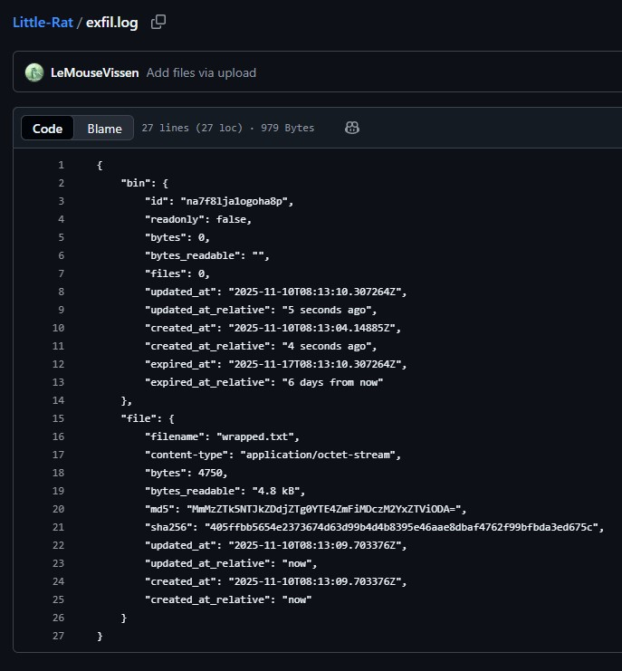
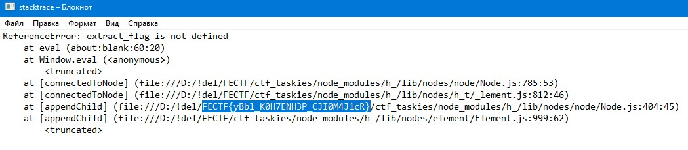

# forensics/OSINT | Little Rat 3 counter-reconnaissance

## Описание

Паркер! У нас эксклюзив для завтрашнего выпуска! Я достал полный дамп сетевого трафика с самого начала этой атаки и до конца! Эти жулики думают, что могут прятаться за шифрованием и легальными сервисами, но "Дейли Бьюгл" докажет обратное! Я требую, чтобы ты отследил каждый их шаг в этом трафике, нашел куда они передают данные и добыл неопровержимые доказательства! У тебя есть время до утра, чтобы подготовить материал для первой полосы! Вперед!

## Флаг

`FECTF{yBbl_K0H7ENH3P_CJI0M4J1cR}`

## Решение

Участникам дан дамп трафика - `little_rat.pcapng`.

Это смешанный таск в основном по форензике и немного по осинту.

### Часть forensics:

Атака, расследуемая в тасках Little Rat 1 и 2, использовала легитимные сервисы.

Все соединения по https -> TLS, однако при запросах DNS и рукопожатии Client Hello в открытом виде передается Server Name Indication (SNI).

**отследил каждый их шаг в этом трафике, нашел куда они передают данные**

В дампе вас должны заинтересовать 3 ключевых домена:
* `api.github.com` — приложение получает ссылку на C2 с одного из репозиториев.
* `roommate-mature-ist-reunion.trycloudflare.com` — туннель до сервера C2.
* `filebin.net` — сервис файлообмена использованный для эксфильтрации данных.

Если вы сначала выполнили таск Little Rat 2, вы наверняка помните `https://filebin.net`. Можно пойти восстанавливать цепочку подозрительной связи с него.

Так же можно отфильтровать по протоколу DNS и искать всего среди 136 пакетов. Другой более полезной информации в дампе то больше и нет.

* В самом начале запрос для `api.github.com`;
* Почти в самом конце `roommate-mature-ist-reunion.trycloudflare.com`
* В самом конце `filebin.net`

### Часть OSINT:

**и добыл неопровержимые доказательства**

Задача участников:
* определить, что `roommate-mature-ist-reunion.trycloudflare.com` указывает на туннель Cloudflare (cloudflared);
* связать обращение к api GitHub с поиском среди его репозиториев;
* найти по коммитам в поиске GitHub репозиторий, связанный с этим туннелем. -> `https://github.com/LeMouseVissen/Little-Rat`.

В репозитории будет находиться файл с названием `exfil.log`, внутри которого лежит ответ `filebin.net` после успешного размещения файла.

В начале ответа есть поле id, если его добавить к ссылке `filebin.net/[id]` то откроется страница для скачивания.

Найти что так можно сделать, варианта вижу 2.
1. На главной `filebin.net` в шаге 3, такая строка `The files will be available at https://filebin.net/i2zqzgf7gq8309ug which is a link you can share.`, может навести на мысль куда id ставить.
2. Найти тот же репозиторий что и я, `https://github.com/rajexploit404/filetemporaryupload`, легко находится при поиске `curl upload filebin`.

Остается скачать этот `wrapped.txt`.

### Часть forensics:

`wrapped.txt` скачанный с `filebin.net/[id]`, является замаскированным zip архивом только с поврежденным хедером (50 4B 03 04 - нормальный; 00 00 03 04 - фактический) и с двух сторон дополнен мусороными байтами.

Проверяя с терминала:
* `file wrapped.txt` -> `wrapped.txt: data`
* `binwalk (https://www.unroll.ing)` -> `offset 1947 - End of Zip archive, footer length: 22`
* `zipinfo wrapped.txt` -> `warning [wrapped.txt]:  1524 extra bytes at beginning or within zipfile`

Собственно, вытащим архив binwalk'ом с оффсетом полученным из `zipinfo`, получим очищенный архив от мусора сверху. В самом архиве восстановим байты и архив сможет открытся.

Проверил, даже в самом `wrapped.txt` комбинация 03 04 встречается 1 раз, можно даже, если понять раньше, удалить верх и восстановить хедер быстрее.
Внутри лежит текстовый файл без расширения, в нем трассировка ошибки серверной стороны локального приложения, среди строк в открытом виде флаг.

